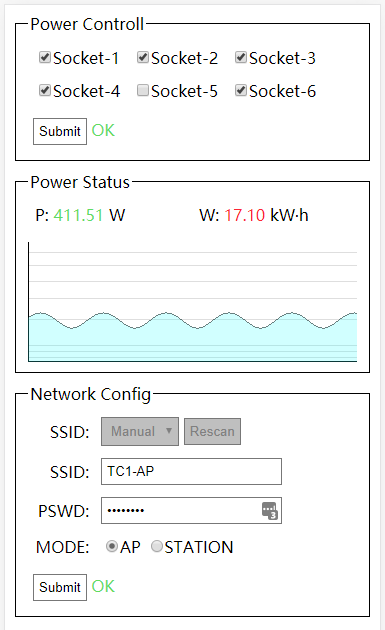
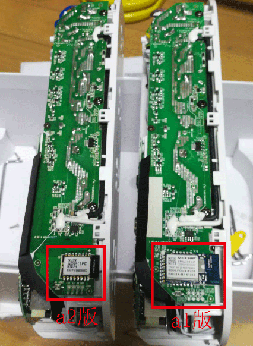

# 斐讯TC1 a1智能排插第三方固件
排插TC1因为服务器关闭,无法使用. 故而为其开发一个不需要服务器也能满足基本智能控制使用的固件.

# 固件web界面

固件启动后, 会开启一个热点 TC1-AP, 连接热点后, 直接用浏览器访问: http://192.168.0.1 即可看到如上web界面.

# 注意

TC1排插硬件分 a1 a2 两个版本, 本固件仅支持**a1版本**. a1 a2两个版本仅主控不同, 除此之外其他无任何区别.

# 区分硬件版本

硬件版本在外包装底部,如图所示:

如果没有包装, 只能拆开分辨, 如图, 左侧为不支持的a2版本 右侧为支持的a1版本.

# 特性

本固件使用斐讯TC1排插硬件为基础,实现以下功能:

- [x] 按键控制总开关
- [x] 独立控制每个插口通断
- [x] Web实时显示功率和功耗
- [x] 添加定时任务控制插口通断
- [x] ota在线升级
- [ ] 通过mqtt连入HomeAssistant

# 联系

如有其它问题, 可以联系本人 Telegram: [@zogodo](https://t.me/zogodo)

或者发送邮件给我: zhogodo@gmail.com

